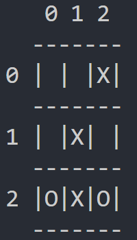

# Rust-TicTacToe
 

I created a small Rust console program to play tictactoe against your friends or an ai.

## Startup
When you start the program you'll be greeted by a mode selection.

**vs**: Play against another player. 
**ai**: Play against the minimax player. 
&emsp;If you choose **ai**, then you will have to choose what to play as: 
&emsp;Either as *x* to begin. 
&emsp;Or as *o* to play second. 

When playing you will have to input the column and then the row you want to make your move.
After you do either the next player will have to input their move or the ai will calculate it's next move.
The ai will then spit out a move and a random number called: Best value. This value is basically the chances it thinks that it's going to win. 
&emsp;If it's playing as X, the higher the better. 
&emsp;If it's playing as O, the lower the better.

## Further Reading
[Geeks for Geeks](https://www.geeksforgeeks.org/minimax-algorithm-in-game-theory-set-1-introduction/) 
[Sebastian Lague](https://www.youtube.com/watch?v=l-hh51ncgDI&ab_channel=SebastianLague) 
[The Coding Train](https://www.youtube.com/watch?v=trKjYdBASyQ&ab_channel=TheCodingTrain) 
